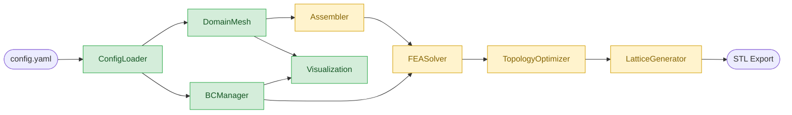

# fglopt — UML Architecture Diagram

> **Color legend:**
> - **Green** — Implemented
> - **Amber** — Planned (not yet started)
> - **Blue** — Future (3D extension)

---

## Class Diagram

```mermaid
classDiagram
    direction TB

    class ConfigLoader {
        +str path
        +dict data
        +__init__(path str)
        +validate()
        +get(key, default) Any
        +get_nested(*keys, default) Any
        +to_dict() dict
    }

    class DomainMesh {
        +int nx
        +int ny
        +float lx
        +float ly
        +ndarray node_coords
        +ndarray element_nodes
        +n_nodes int
        +n_elements int
        +__init__(nx, ny, lx, ly)
        +get_node_position(node_id) tuple
        +get_element_nodes(elem_id) tuple
        +plot(title, show, ax) Axes
    }

    class BCManager {
        -ConfigLoader _config
        -list _fixed
        -list _loads
        +get_constrained_dofs(mesh) ndarray
        +build_force_vector(mesh) ndarray
        -_resolve_nodes(mesh, entry) list
        -_select_edge_nodes(mesh, selector) list
    }

    class Visualization {
        <<module: fea/visualization.py>>
        +visualize_boundary_conditions(bc_manager, mesh, ...) Path
    }

    class REPLConsole {
        <<module: main.py>>
        +launch_console()
        +plot_mesh_from_config(config, output_path)
        +run_topology_optimization(config)
    }

    class Q4Element {
        <<Phase 2 - fea/element.py>>
        +float E
        +float nu
        +int n_dofs_per_node
        +stiffness_matrix(lx, ly) ndarray
        +shape_functions(xi, eta) ndarray
        +strain_displacement_matrix(xi, eta) ndarray
        +constitutive_matrix() ndarray
    }

    class Assembler {
        <<Phase 3 - fea/assembler.py>>
        +assemble_global_stiffness(mesh, element) csr_matrix
        +local_to_global_dofs(mesh, elem_id) ndarray
    }

    class FEASolver {
        <<Phase 4-5 - fea/solver.py>>
        +solve(K, F, constrained_dofs) ndarray
        +apply_dirichlet_bcs(K, F, dofs) tuple
        +compute_compliance(F, u) float
    }

    class TopologyOptimizer {
        <<Planned - optimization>>
        +ndarray density
        +float volume_fraction
        +float penalty
        +run(config, mesh) ndarray
        +simp_stiffness(rho, E0, p) float
    }

    class LatticeGenerator {
        <<Planned - lattice>>
        +generate(mesh, density)
        +export_stl(path)
    }

    class HexElement {
        <<3D Extension - fea/element.py>>
        +int n_dofs_per_node
        +stiffness_matrix(lx, ly, lz) ndarray
        +shape_functions(xi, eta, zeta) ndarray
    }

    class Mesh3D {
        <<3D Extension - mesh>>
        +int nx
        +int ny
        +int nz
        +float lx
        +float ly
        +float lz
        +generate()
        +get_node_position(node_id) tuple
        +get_element_nodes(elem_id) tuple
    }

    BCManager --> ConfigLoader : reads config
    REPLConsole ..> ConfigLoader : loads
    REPLConsole ..> DomainMesh : creates
    REPLConsole ..> BCManager : creates
    REPLConsole ..> Visualization : calls
    Visualization ..> BCManager : reads
    Visualization ..> DomainMesh : reads
    Assembler ..> DomainMesh : queries connectivity
    Assembler ..> Q4Element : computes K_e per element
    FEASolver ..> Assembler : builds K
    FEASolver ..> BCManager : reads F and constrained DOFs
    TopologyOptimizer ..> FEASolver : calls repeatedly
    TopologyOptimizer ..> DomainMesh : reads mesh
    TopologyOptimizer ..> ConfigLoader : reads V* and penalty
    LatticeGenerator ..> DomainMesh : uses mesh geometry
    LatticeGenerator ..> TopologyOptimizer : consumes density field
    HexElement --|> Q4Element : extends (3D)
    Mesh3D --|> DomainMesh : extends (3D)

    classDef implemented fill:#d4edda,stroke:#28a745,color:#155724
    classDef planned fill:#fff3cd,stroke:#d39e00,color:#856404
    classDef future fill:#d1ecf1,stroke:#17a2b8,color:#0c5460

    class ConfigLoader,DomainMesh,BCManager,Visualization,REPLConsole implemented
    class Q4Element,Assembler,FEASolver,TopologyOptimizer,LatticeGenerator planned
    class HexElement,Mesh3D future
```

---

## Pipeline Flowchart


